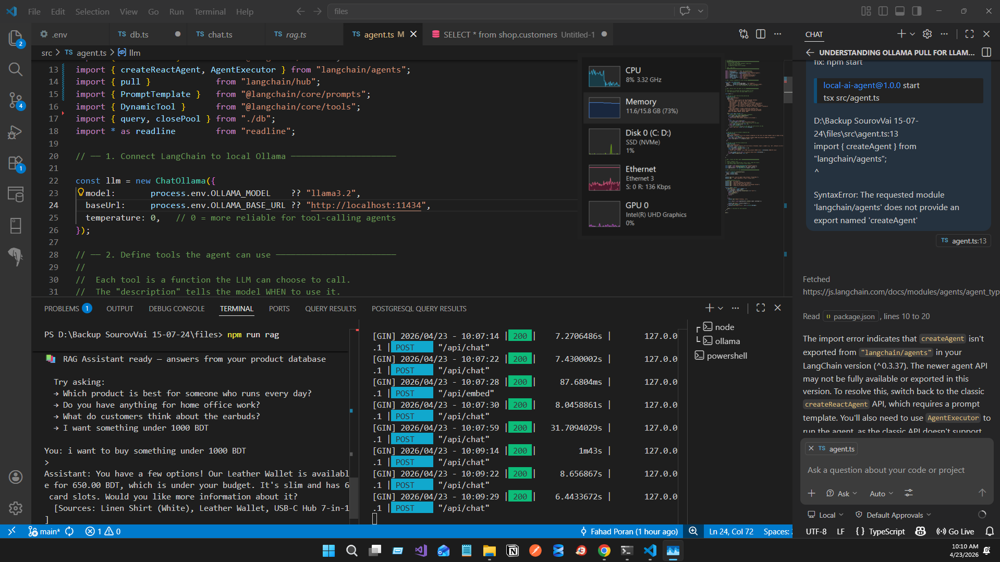

# Local AI Agent — Ollama + LangChain + PostgreSQL

A fully local AI agent that queries your PostgreSQL database and answers questions using a local LLM. No cloud, no API keys, no data leaves your machine.

---

## What is inside

```
local-ai-agent/
├── sql/
│   └── seed.sql       ← dummy e-commerce DB (8 customers, 10 products, orders, reviews)
├── src/
│   ├── db.ts          ← PostgreSQL connection pool (shared by all scripts)
│   ├── chat.ts        ← Step 1: verify Ollama is running
│   ├── agent.ts       ← Step 2: AI agent that queries your database
│   └── rag.ts         ← Step 3: RAG pipeline — semantic product search
├── .env               ← your config (edit before running)
├── package.json
├── tsconfig.json
└── README.md
```

### How the pieces connect

```
Your question
     │
     ▼
LangChain (agent.ts / rag.ts)
     │  decides which tool to call
     ▼
Ollama (localhost:11434)        ←── LLM running on your CPU/GPU
     │
     ▼
PostgreSQL (localhost:5432)     ←── your real data
     │
     ▼
Answer back to you
```

- **Ollama** — runs the LLM locally (Llama 3, Mistral, DeepSeek, etc.)
- **LangChain** — the orchestration layer: gives the LLM tools, memory, and RAG
- **PostgreSQL** — your database; the agent reads it with safe SELECT queries

---

## Prerequisites

| Tool | Minimum version | Install |
|---|---|---|
| Node.js | 18+ (22 recommended) | https://nodejs.org |
| PostgreSQL | 14+ | https://www.postgresql.org/download |
| Ollama | latest | https://ollama.com |

---

## Step 1 — Install Ollama and pull models

Download Ollama from https://ollama.com and install it.

Then pull the two models this project uses:

```bash
# Chat model — used by the agent and RAG to generate answers (~2 GB)
ollama pull llama3.2

# Embedding model — used by RAG to convert text into vectors (~270 MB)
ollama pull nomic-embed-text
```

Start the Ollama server (on Windows/Mac it may already run as a background service):

```bash
ollama serve
```

Verify it is running by visiting http://localhost:11434 in your browser. You should see `Ollama is running`.

---

## Step 2 — Set up the database

Make sure PostgreSQL is running locally, then create the dummy e-commerce database:

```bash
psql -U postgres -d postgres -f sql/seed.sql
```

Expected output:

```
DROP SCHEMA
CREATE SCHEMA
...
       result
───────────────────────────────────────
 Database seeded successfully ✓
```

### What the dummy database contains

**8 customers** — Rafiq, Nusrat, Tanvir, Sumaiya, Karim, Fatema, Mehedi, Riya (cities across Bangladesh)

**10 products** across 5 categories:

| Product | Category | Price (BDT) | Stock |
|---|---|---|---|
| Wireless Earbuds Pro | Electronics | 2,500 | 45 |
| Mechanical Keyboard | Electronics | 4,200 | 12 |
| USB-C Hub 7-in-1 | Electronics | 980 | 60 |
| Linen Shirt | Clothing | 1,200 | 80 |
| Running Shoes | Footwear | 3,500 | 25 |
| Leather Wallet | Accessories | 650 | 100 |
| Python Crash Course Book | Books | 850 | 30 |
| Standing Desk Mat | Office | 1,100 | 40 |
| Stainless Water Bottle | Kitchen | 450 | 90 |
| Yoga Mat | Sports | 780 | 35 |

**10 orders** with statuses: delivered, shipped, pending, cancelled
**8 reviews** with ratings and comments
**2 SQL views** the agent uses: `shop.order_summary` and `shop.product_stats`

---

## Step 3 — Configure your environment

Edit the `.env` file:

```env
# PostgreSQL
PG_HOST=localhost
PG_PORT=5432
PG_DATABASE=postgres
PG_USER=postgres
PG_PASSWORD=yourpassword       ← change this to your actual password

# Ollama
OLLAMA_BASE_URL=http://localhost:11434
OLLAMA_MODEL=llama3.2
OLLAMA_EMBED_MODEL=nomic-embed-text
```

---

## Step 4 — Install dependencies

```bash
npm install
```

This installs `tsx` (the modern TypeScript runner for Node 18+), LangChain, and the PostgreSQL client.

---

## Step 5 — Test Ollama connection

```bash
npm run chat
```

Expected output:

```
Testing connection to Ollama model: llama3.2
Sending test message...

✅  Ollama is working!

Response: Hello! I'm running locally on your machine via Ollama. How can I help you?
```

If you see an error, check the Troubleshooting section below.

---

## Step 6 — Run the database agent

```bash
npm start
```

The agent answers questions by writing SQL and querying your database. Try these:

```
You: How many customers do we have?
You: Which products have the lowest stock?
You: What is the total revenue from delivered orders?
You: Show me all pending orders with customer names
You: Which product has the highest average rating?
You: How many orders were placed in the last 30 days?
You: Which city has the most customers?
You: What is the most expensive product in stock?
```

The agent uses a ReAct loop (Reason + Act):
1. Reads your question
2. Decides to call the `query_database` tool with a SQL SELECT
3. Gets the rows back from PostgreSQL
4. Forms a natural-language answer

---

## Step 7 — Run the RAG assistant

```bash
npm run rag
```

RAG (Retrieval-Augmented Generation) embeds your product descriptions and reviews into vectors, then finds the most relevant ones for each question — no SQL needed.

The first run takes 20–30 seconds to embed all documents. Subsequent questions are fast.

Try these:

```
You: I need something for running every day
You: What do customers think about the earbuds?
You: Recommend something under 1000 BDT
You: Do you have anything for a home office setup?
You: I want a gift for someone who reads a lot
You: Which product has the best customer reviews?
```

Each answer shows the source products that were retrieved as context.

---

## Connecting your real database

To use your own database instead of the dummy one:

1. Update `.env` with your actual database credentials
2. In `src/agent.ts`, update the `description` field of the `query_database` tool to list your real table names and schema
3. In `src/rag.ts`, update the SQL query in `loadDocumentsFromDB()` to load your own text content

---

## Swapping the LLM model

Edit `.env` and change `OLLAMA_MODEL` to any model you have pulled:

```env
OLLAMA_MODEL=mistral
OLLAMA_MODEL=deepseek-r1
OLLAMA_MODEL=phi4
OLLAMA_MODEL=gemma3
```

Pull the model first: `ollama pull mistral`

Smaller models (phi4, gemma3:2b) are faster but may produce less accurate SQL. Llama 3.2 is a good default balance.

---

## Upgrading RAG to persistent vector storage

The RAG pipeline uses in-memory vectors by default — they are lost when the process stops. For production, store embeddings in PostgreSQL using the pgvector extension.

**Install pgvector:**

```bash
# Ubuntu/Debian
sudo apt install postgresql-16-pgvector

# Mac with Homebrew
brew install pgvector
```

**Enable in your database:**

```sql
CREATE EXTENSION vector;
```

**Swap the vector store in `src/rag.ts`:**

```typescript
// Remove:
import { MemoryVectorStore } from "langchain/vectorstores/memory";

// Add:
import { PGVectorStore } from "@langchain/community/vectorstores/pgvector";

// Replace MemoryVectorStore.fromDocuments(...) with:
const vectorStore = await PGVectorStore.fromDocuments(docs, embeddings, {
  postgresConnectionOptions: {
    host:     process.env.PG_HOST,
    port:     Number(process.env.PG_PORT),
    database: process.env.PG_DATABASE,
    user:     process.env.PG_USER,
    password: process.env.PG_PASSWORD,
  },
  tableName: "product_embeddings",
});
```

---

## Troubleshooting

### `ECONNREFUSED` on localhost:11434

Ollama is not running. Start it:

```bash
ollama serve
```

### `model "llama3.2" not found`

The model has not been pulled yet:

```bash
ollama pull llama3.2
```

### `relation "shop.customers" does not exist`

The database seed has not been run. Execute:

```bash
psql -U postgres -d postgres -f sql/seed.sql
```

### `password authentication failed for user "postgres"`

The password in `.env` does not match your local PostgreSQL setup. Update `PG_PASSWORD`.

On Windows, the default PostgreSQL password is set during installation. On Mac with Homebrew, peer auth may be used — try setting `PG_USER` to your system username.

### `npm run rag` — embedding is very slow

Embedding 10 products on CPU takes 20–60 seconds on the first run. This is normal. For faster embeddings, use a smaller model:

```bash
ollama pull all-minilm
```

Then in `.env`: `OLLAMA_EMBED_MODEL=all-minilm`

### ExperimentalWarning or DeprecationWarning about `--loader`

You are running an old version of the scripts that used `ts-node`. The fix:

1. Make sure your `package.json` scripts use `tsx` (not `node --loader ts-node/esm`)
2. Run `npm install` again to install `tsx`
3. Delete `node_modules` and reinstall if the warning persists

---

## npm scripts reference

| Command | What it does |
|---|---|
| `npm run chat` | Quick test — confirms Ollama is reachable |
| `npm start` | Database agent — natural language → SQL → answer |
| `npm run rag` | RAG assistant — semantic product search |
| `npm run seed` | Re-seeds the PostgreSQL database |


----------------------
**Understanding the concept**

[!concepts](langchain_role_diagram.png)
```
The simple way to think about it: Ollama is the engine, PostgreSQL is the data, and LangChain is the driver that knows how to use both together. Without LangChain you could still talk to Ollama directly (with fetch), but you'd have to write the tool-calling loop, prompt formatting, retrieval pipeline, and output parsing yourself — probably 300–400 lines of plumbing code that LangChain gives you for free.
```